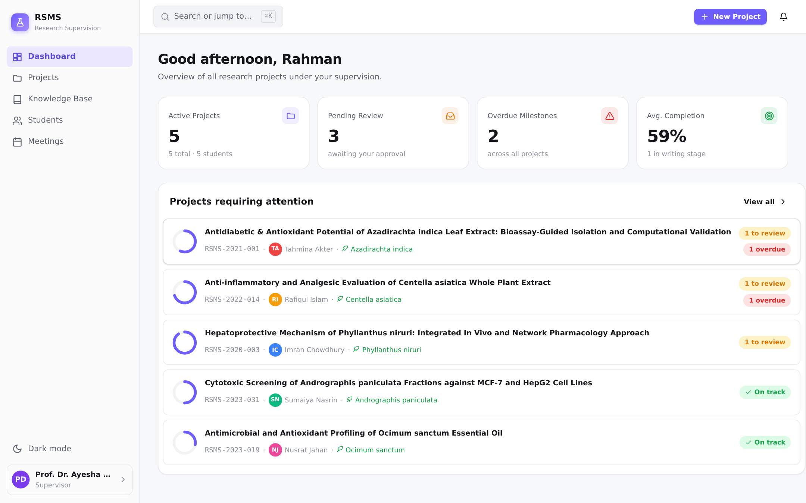

# RSMS — Research Supervision Management System

A complete, production-ready digital research management ecosystem for **pharmaceutical, biomedical and natural product research laboratories**.

RSMS treats every research project as a **flexible collection of research modules** rather than a single category. A single project can span medicinal plant collection and extraction, phytochemical screening, multiple *in vitro* bioassays, *in vivo* animal studies, computational drug discovery (molecular docking, MD simulation, ADMET, network pharmacology), and finally statistical analysis, manuscript preparation and thesis submission — all inside one workspace.



---

## ✨ Features

- **Role-based access** — Admin, Supervisor and Student roles with enforced permissions.
- **Modular projects** — Build a custom workflow from a library of **48 research modules** across 6 categories (Sample Preparation, Phytochemical & Analytical, *In Vitro* Bioassay, *In Vivo* & Pharmacology, Computational, Analysis & Documentation).
- **Independent milestones** — Each module has its own status, progress %, deadline, documents, instructions, approval history and discussion.
- **Supervisor dashboard** — Monitor all projects, pending reviews, overdue milestones, module distribution and average completion, with advanced filtering (degree, status, stage, plant, disease, search).
- **Student workspace** — Personalised timeline, upcoming deadlines, revision requests, status summary and meetings.
- **Document management** — Per-module file uploads with automatic **version tracking**.
- **Project-scoped communication** — Comments, questions, revision requests and approvals, all logged in a complete activity history.
- **Knowledge Repository** — Institutional SOPs, protocols, tutorials, templates, FAQs and troubleshooting guides; turn answered questions into permanently searchable entries.
- **Meetings & notifications** — Schedule supervisory meetings and receive in-app notifications.
- **Polished UI** — Command palette (⌘K / Ctrl+K), light/dark themes, skeleton loading, responsive layout, smooth animations.

---

## 🛠 Tech Stack

- **Backend:** Node.js + Express, SQLite (`better-sqlite3`), JWT auth (httpOnly cookies), `bcryptjs`, `multer` uploads.
- **Frontend:** Dependency-free vanilla JS SPA (custom router, component helpers, design system in CSS variables). No build step required.

---

## 🚀 Getting Started

```bash
# 1. Install dependencies
npm install

# 2. Seed the database with sample data (5 projects, students, knowledge base)
npm run seed

# 3. Start the server
npm start
```

Then open **http://localhost:3000**.

### Demo accounts

| Role        | Email                       | Password    |
|-------------|-----------------------------|-------------|
| Supervisor  | `supervisor@rsms.edu`       | `super123`  |
| Student     | `tahmina@student.rsms.edu`  | `student123`|
| Admin       | `admin@rsms.edu`            | `admin123`  |

---

## 📁 Project Structure

```
rsms/
├── server/
│   ├── index.js            # Express app + SPA fallback
│   ├── db/
│   │   ├── index.js        # SQLite connection
│   │   ├── schema.sql      # Database schema
│   │   ├── catalog.js      # 48-module research library
│   │   └── seed.js         # Sample data seeder
│   ├── middleware/auth.js  # JWT auth + role guards
│   └── routes/
│       ├── auth.js         # Login / logout / me
│       └── api.js          # Projects, modules, files, comments, knowledge…
└── public/
    ├── index.html
    ├── css/app.css         # Design system (light/dark)
    └── js/
        ├── core.js         # API client, router, store, helpers
        ├── shell.js        # Sidebar, topbar, command palette
        └── pages/          # dashboard, projects, project, knowledge, …
```

The architecture is intentionally modular so future features — AI assistance, lab inventory, publication management, computational tooling — can be added without restructuring.

---

## 🔒 Notes

- The database (`server/db/rsms.db`) and uploads are git-ignored; run `npm run seed` to regenerate sample data.
- Set a strong `JWT_SECRET` environment variable in production.

## License

MIT
